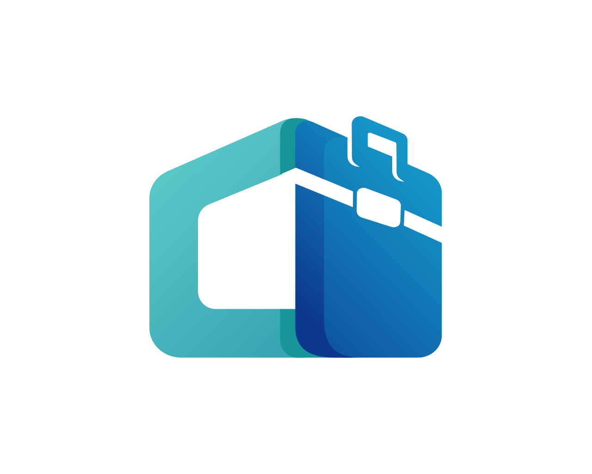

# LinkJob - 말 통하는 외국인 채용!

  

  <h3>한국에서 일자리를 찾는 외국인과 외국인 직원을 찾는 기업을 연결합니다</h3>

  
  
  

  

    <a href="#특징">특징</a> •
    <a href="#스크린샷">스크린샷</a> •
    <a href="#기술-스택">기술</a> •
    <a href="#팀">팀</a> •
    <a href="#문의">문의</a>
  

---

## 🎯 LinkJob이란?

LinkJob은 **한국에서 일자리를 찾는 외국인 구직자**와 **외국인 직원을 채용하려는 한국 기업**을 효과적으로 연결하는 모바일 플랫폼입니다.

## ✨ 특징

### 🌟 핵심 기능

#### 📍 GPS 기반 매칭
- 사용자 위치 기반 근거리 일자리 우선 추천

#### 🎓 한국어 능력 검증
- 내장된 한국어 시험 시스템
- 기업 맞춤형 시험 문제 출제

#### 💬 실시간 커뮤니케이션
- Socket.io 기반 즉시 메시징
- 12개 언어 실시간 번역
- 면접 일정 조율 채팅

## 📱 앱 기능

<table>
<tr>
<td width="50%" valign="top">

### 👤 구직자용

#### 일자리 찾기
- 🔍 스마트 검색 필터
- 📍 GPS 거리순 정렬
- 🔖 관심 공고 북마크

#### 지원 관리
- 📝 원클릭 지원
- 📋 지원 현황 추적

#### 프로필
- 🌍 다국어 프로필
- 🎓 자격증 관리
- 📊 프로필 완성도

</td>
<td width="50%" valign="top">

### 🏢 기업용

#### 채용 공고
- ✍️ 스마트 공고 작성
- 🎯 타겟 키워드 설정
- 💼 복수 포지션 관리

#### 지원자 관리
- 📝 한국어 시험 출제

#### 프리미엄
- 💎 플래티넘 패스
- 📈 상세 분석

</td>
</tr>
</table>

## 🌍 지원 언어

| 언어 | 코드 | 언어 | 코드 |
|------|------|------|------|
| 🇰🇷 한국어 | ko | 🇬🇧 English | en |
| 🇯🇵 日本語 | ja | 🇨🇳 中文 | zh |
| 🇻🇳 Tiếng Việt | vi | 🇮🇳 हिन्दी | hi |
| 🇱🇰 සිංහල | si | 🇸🇦 العربية | ar |
| 🇹🇷 Türkçe | tr | 🇲🇲 မြန်မာ | my |
| 🇰🇬 Кыргызча | ky | 🇲🇳 Монгол | mn |

## 📸 스크린샷

  
  
  
  

## 🛠 기술 스택

### Frontend

### Backend

### Infrastructure

## 👥 팀

**Welkit** - 외국인과 한국 기업을 연결하는 기술 스타트업

- 🏢 **회사**: (주)웰킷
- 📍 **위치**: 서울특별시
- 👥 **팀원**: 3명
- 🚀 **설립**: 2025년

## 📞 문의

### 🏢 기업 문의
- **이메일**: welkit.answer@gmail.com
- **전화**: 

### 👤 사용자 지원
- **이메일**: welkit.answer@gmail.com

### 💼 제휴/투자 문의
- **이메일**: welkit.answer@gmail.com

### 👨‍💻 개발자 문의
- **이메일**: simsgood0807@gmail.com
- **GitHub**: [@welkit](https://github.com/hyson0807)

## 📱 다운로드

  
  

## 📄 라이선스

Copyright © 2024 Welkit. All rights reserved.

본 저장소의 콘텐츠는 정보 제공 목적으로만 공개되었습니다.
소스 코드는 별도의 Private Repository에서 관리됩니다.

---

  <b>한국에서 꿈을 이루세요, LinkJob과 함께! 🚀</b>

  Made with ❤️ by Welkit Team

